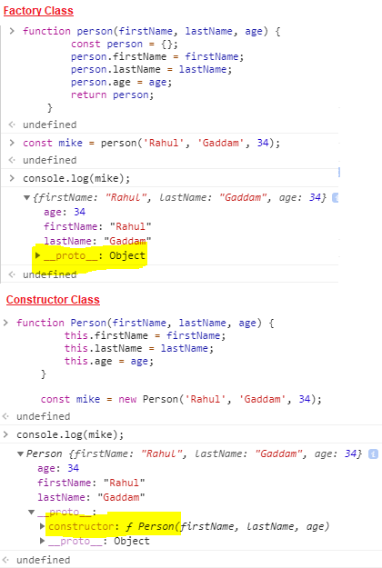

# ES6 Features for React

## Variable Definition
- Before ES6 varaiable declaration `Global` and `Function scoped`.
- With `ES6` using new keywords varaiable declaration can be enhaced support `block scope` like other programing launguage.
- Two new keywords added in ES6 for variable declaration
  - **let:**
    - Support re-declaration of same variable in nested blocks.
    - Does not support re-declaration of same variable in same block.
  - **const:**
    - This is similar to let but does not allow to change primitive values assigned.
    - In case of Objects/Arrays, const support updating object properties and not support changing the reference of the object.

## Higher Order Function
- ES6 introduced 5 functions `(forEach, filter, map, sort, reduce)` that support eazy manupulations of Arrays. 
- Details of each method with examples of is available [here](../02-MyDev/02/es6/index.js)

## Rest Operator
- It is a `collection` of all remaining elements.
  ```javascript
  var myName = ["Marina" , "Magdy" , "Shafiq"] ;
  const [firstName , ...familyName] = myName ;
  
  //familyName is rest operator
  ```

## Spread Operator
- It’s the opposite to rest parameter , where rest parameter collects items into an array, the spread operator `unpacks` the collected elements into single elements.
  ```javascript
  var myName = ["Marina" , "Magdy" , "Shafiq"];
  var newArr = [...myName ,"FrontEnd" , 24];

  //myName is a spread operator
  ```

## Destructuring
- Supports extracting data for object/arrays.
- Examples are available [here](../02-MyDev/02/es6/index.js)

## Class
- In Javascript functions can be used to create objects.
- ES5 supported two types of functions.  
  - **Factory:**
    - These are regular Javascript functions.
    - It requires `return` keyword.
    - These return objects without use of `new` keyword.
    - Binds `instance.__proto__` to `Constructor.prototype`.
      ```javascript
      function person(firstName, lastName, age) {
          const person = {};
          person.firstName = firstName;
          person.lastName = lastName;
          person.age = age;
          return person;
      }
  
      const rahul = person('Rahul', 'Gaddam', 34);
      console.log(rahul);
      ``` 
  - **Constructor:**
    - These functions are `Capital case` in general.
    - The `return` keyword is implicit.
    - These return objects by using `new` keyword.
    - Before every variable `this` keyword should be used.
    - Binds `instance.__proto__` to `Object`.
      ```javascript
      function Person(firstName, lastName, age) {
          this.firstName = firstName;
          this.lastName = lastName;
          this.age = age;
      }
  
      const rahul = new Person('Rahul', 'Gaddam', 34);
      console.log(rahul);
      ```
- To simplify the definition of Constructor functions, ES6 introduced Classes.
  - A JavaScript class is not an object. It is a `template for JavaScript objects`.
  - The `constructor method` is called `automatically` when a new object is created.
  - Class is `syntactic sugar` of `Constructor Functions`.
  - It supports inheritance using `extends` keyword similar to `Java`.
  - It supports `super` keyword to call super constructor.
  - It support `static` methods that can be accessed without creation of Object using `new` keyword.
    ```javascript
    class Person{
      constructor(firstName, lastName, age){
        this.firstName = firstName;
        this.lastName = lastName;
        this.age=age;
      }
    }
  
    const rahul = new Person('Rahul', 'Gaddam', 34);
    console.log(rahul);
    ```

  

## Arrow Function
- These are eazy ways of writing functions.
- If written in signle line, `return` statement is automatically added.
- Arrow function does not have its own `this`. So `this` refers to its parent scope.
- Variable argument notation should be used `...args` to reference multiple arguments. 
  ```javascript
  //Arrow Function with No Argument
  let greet = () => console.log('Hello');
  greet(); // Hello
  
  //Arrow Function with One Argument
  let greet = x => console.log(x);
  greet('Hello'); // Hello 
  
  //Multiline Arrow Functions
  let sum = (a, b) => {
      let result = a + b;
      return result;
  }
  
  let result1 = sum(5,7);
  console.log(result1); // 12
  
  //Args Example
  let x = (...n) => {
      console.log(n);
  }
  
  x(4,6,7); // [4, 6, 7]
  ```

## Module Loader
- ES6 added support for Module Loader using keywords `import` and `export`
- ES6 supports exposting and importing both functions and variables using Module Loader.
- Module loader can be used in browser using `type="module"` in `<script>` tag
- Any browser supoorting ES6 modules will ignore code with `nomodule` in `<script>` tag to allow ES5 browser support old ways of module loading using `<script>` tag.
- If there are multiple varaiables, functions to be exposted; ES6 supports exposting 1 default module using `default` keyword and others using `name export`.
- Named exports are denoted by `{}` and should be imported with same name.
- To change the name of named expost refernces in the new file, ES6 support usage of `as` keyword for alliasing.
  ```javascript
  //lib.js
  
  const PI = 3.1415926;
  
  // private function
  function log(...msg) {
    console.log(...msg);
  }
  
  //default export
  export default PI;
  //named export
  export {log}
  
  ```
  ```javascript
  //main.js
  
  import P,{log as clog}  from ./lib.js
  ```

## Promise
- A promise is a container for a future value. 
- Promises are created when a certain task’s completion time is uncertain or too long.
- Promises are all about making this type of asynchrony easy and effortless.
- A promise can be one of these three state:
  - **Pending** — This is the initial state or state during execution of promise. Neither fulfilled nor rejected
  - **Fulfilled** — Promise was successful.
  - **Rejected** — Promise failed.
- Promises accepts two parameters conventionally named `resolve` and `reject`, mark successful and unsuccessful eventual completion of the executor function, respectively.
  ```javascript
  let done = true

  const isItDoneYet = new Promise((resolve, reject) => {
    if (done) {
      const workDone = 'Here is the thing I built'
      resolve(workDone)
    } else {
      const why = 'Still working on something else'
      reject(why)
    }
  })
  ```
- All Promise instances have a `.then()` method on them. 
  - This method  accepts two callbacks.
  - The `first callback` is invoked when the promise is `resolved`.
  - The `second callback` is executed when the promise is `rejected`.
  - If the arguments supplied are not functions, they must be ignored.
- A promise can only `succeed(resolved)` or `fail(reject)` once. The state of promise won’t change even if you attach `.then` handler multiple times.
- The `.catch()` can be used to handle rejections from promise or the success function call.
  - This can be segretaed using below. `save` function error is handled by `handleNetworkError` and `handleSuccess` is handled by `handleProgrammerError`

    ```javascript
    save()
    .then(
      handleSuccess,
      handleNetworkError
    )
    .catch(handleProgrammerError);
    ``` 
- Promises `chaining` can be used when we have a sequence of asynchronous tasks to be done one after another.
  - All of the operations return there results to the next `then()` function on resolve and this process continues till the chain is complete. 
  
    ```javascript
     fetch(url)
     .then(process)
     .then(save)
     .catch(handleErrors);
    ```
- To synchronize different promises, `Promise.all()` helps define a list of promises, and execute something when they are all resolved.
  ```javascript
  const f1 = fetch('/something.json')
  const f2 = fetch('/something2.json')

  Promise.all([f1, f2]).then(([res1, res2]) => {
    console.log('Results', res1, res2)
  })
  ```
- `Promise.race()` runs as soon as one of the promises passed is resolved.
   - It runs the attached callback with the result of the first promise resolved.
  ```javascript
  const promiseOne = new Promise((resolve, reject) => {
    setTimeout(resolve, 500, 'one')
  })
  const promiseTwo = new Promise((resolve, reject) => {
    setTimeout(resolve, 100, 'two')
  })

  Promise.race([promiseOne, promiseTwo]).then(result => {
    console.log(result) // 'two'
  })
  ```

## Async Await
- Async and Await are extensions of promises.
  - **Async:**
    - Enable us to write promise based code as if it were synchronous.
    - It operates asynchronously via the event-loop.
    - Async functions will always return a value.
    - Using `async` simply implies that a promise will be returned, and if a promise is not returned, JavaScript automatically wraps it in a `resolved` promise with its value.
  - **Await:**
    - The await operator is used to wait for a Promise.
    - It can be used inside an Async block only.
    - Await makes JavaScript wait until the promise returns a result.
    - Only the `async` function block wait and not the whole program execution.

  ```javascript
  async function sequence() {
    await promise1(50); // Wait 50ms…
    await promise2(50); // …then wait another 50ms.
    return "done!";
  }
  ```