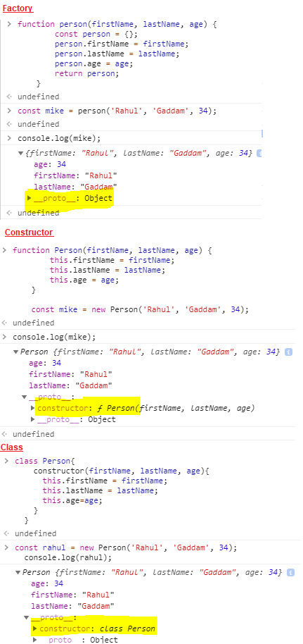

# ES6 Features for React

## Variable Definition
## Class
- In Javascript functions can be used to create objects.
- ES5 supported two types of functions.  
  - **Factory:**
    - These are regular Javascript functions.
    - It requires `return` keyword.
    - These return objects without use of `new` keyword.
    - Binds `instance.__proto__` to `Constructor.prototype`.
    ```javascript
    function person(firstName, lastName, age) {
        const person = {};
        person.firstName = firstName;
        person.lastName = lastName;
        person.age = age;
        return person;
    }

    const rahul = person('Rahul', 'Gaddam', 34);
    console.log(rahul);
    ``` 
  - **Constructor:**
    - These functions are `Capital case` in general.
    - The `return` keyword is implicit.
    - These return objects by using `new` keyword.
    - Before every variable `this` keyword should be used.
    - Binds `instance.__proto__` to `Object`.
    ```javascript
    function Person(firstName, lastName, age) {
        this.firstName = firstName;
        this.lastName = lastName;
        this.age = age;
    }

    const rahul = new Person('Rahul', 'Gaddam', 34);
    console.log(rahul);
    ```
- To simplify the definition of Constructor functions, ES6 introduced Classes.
  - A JavaScript class is not an object. It is a `template for JavaScript objects`.
  - The `constructor method` is called `automatically` when a new object is created.
  - Class is `syntactic sugar` of `Constructor Functions`.
  - It supports inheritance using `extends` keyword similar to `Java`.
  - It supports `super` keyword to call super constructor.
  - It support `static` methods that can be accessed without creation of Object using `new` keyword.
  ```javascript
  class Person{
    constructor(firstName, lastName, age){
      this.firstName = firstName;
      this.lastName = lastName;
      this.age=age;
    }
  }

  const rahul = new Person('Rahul', 'Gaddam', 34);
  console.log(rahul);
  ```

  
## Arrow Function
## Module Loader
