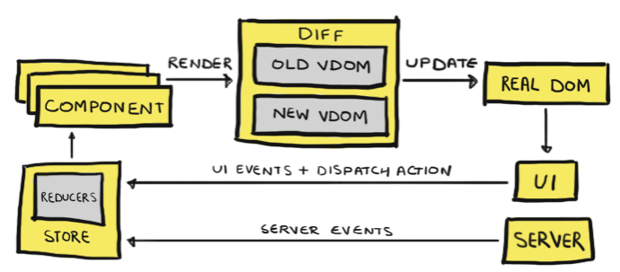

# React.js

- [Overview](#overview)
- [Architecture](#architecture)
- [Installation](#installation)
- [Modules](#modules)
- [Appendix](#appendix)

## Overview
- React.js is an open-source, front end, JavaScript `library` for building user interfaces or UI components.
- It is maintained by `Facebook` and a community of individual developers and companies.
- React is only concerned with `state management` and `rendering` that state to the `DOM`. 
- React is called `library` instead of `framework` because it only supports `DOM manipulations`. 
  - Other UI framework capabilities like routing, two-way-data-binding will be handled by other libraries.

## Architecture
- Major challenge faced during complex UI codebase is involvement of massive team members.
- More time is spent in determining what code does what. React solves this with below:
    - Complexity of UI code is addressed by break down application into smaller, single-purpose `Components`.
    - Each component maintains a `State`. Based on user interactions, React re-renders components by reacting to change in state.
    - During re-rendering, once the component is ready to render, a virtual snapshot of the change in component state is taken.
    - React now compares the snapshot with the real `DOM` and analyzes the differences. Once it finds the difference, the changes are applied to the UI that’s reflected on the user’s screen. 
    - React uses Virtual DOM (`VDOM`) process to update actual DOM. This has following steps
      - Create a VDOM with a new state
      - Compare it with older VDOM
      - Update only different nodes in real DOM
      - Assign new VDOM as an older VDOM



## Installation
- React installation require below:
  - **React**
    - **Core:**
      - `React` is a javascript library, designed for building better user interfaces.
      - It is used to provide `component`, `classes`, `createelement`, etc.
    - **DOM:**
      - `React-DOM` is a complimentary library to React which glues React to the browser DOM.
      - It provides methods like `render()` or `findDOMNode()`
  - **Babel 7.9**
    - It is used for latest ECMAScript and JSX syntax support from React 17.
    - Below package will be used
      - `babel-core:` The main engine of babel plugin.
      - `babel-preset-env:` ECMAScript support.
      - `babel-preset-react:` Compiles JSX syntax to javascript.
      - `babel-loader:` Used to bridge communication between Webpack and Babel.
  - **Webpack 5**
    - It is most widely used and an accepted `module bundler` and `task runner` throughout React.js community.
    - Below package will be used
      - `webpack:` The main engine of webpack plugin.
      - `webpack-cli:` Allow to access webpack commands through CLI.
      - `webpack-dev-server:` A minimal server for client-side development.
      - `html-webpack-plugin:` Generate a html file and hooks with `index.js` file.
      - `html-loader:` Export html as string to be read by webpack.
- HelloWorld React App steps
  ```sh
  # Initialize NPM Project
  npm init -y

  # Required during Runtime
  npm i -S react react-dom

  # Required during Development-only
  npm i -D @babel/core @babel/preset-env @babel/preset-react babel-loader
  npm i -D webpack webpack-cli webpack-dev-server html-webpack-plugin
  npm i -D html-loader path

  # Babel Configuration
  vi .babelrc
    {
        "presets": [
            "@babel/preset-env", 
            "@babel/preset-react"
        ],
        {
            "runtime": "automatic"
        }
    }

  # Webpack Configuration
  vi webpack.config.js

    const path = require('path');
    const HTMLWebpackPlugin = require('html-webpack-plugin');
 
    module.exports = {
        mode: 'development',
        entry: path.resolve(__dirname, './src/index.js'),
        module: {
            rules: [
            {
                test: /\.(js|jsx)$/,
                exclude: /node_modules/,
                use: ['babel-loader'],
            },
            {
                test: /\.html$/i,
                use: [
                    {
                        loader: 'html-loader'
                    }
                ]
            }
            ],
        },
        resolve: {
            extensions: ['*', '.js', '.jsx'],
        },
        plugins: [
            new HTMLWebpackPlugin({
                template: './src/index.html',
                filename: './index.html'
            })
        ],
        output: {
            path: path.resolve(__dirname, './dist'),
            filename: 'index.js',
        },
        devtool: 'inline-source-map',
        devServer: {
            contentBase: path.resolve(__dirname, './dist'),
        },
    };

    # NPM Script Update
    "scripts": {
        "start": "webpack-dev-server --mode development --open --hot",
        "build": "webpack --mode production"
    } 

    # Folders
    mkdir -m777 src
    mkdir -m777 dist
  ```
- Adding live-reload
- Adding Webpack Module Federation 

## Modules
Below are the basic building blocks of React.js
- Components
- JSX
- State
- Props
- Router
- Event Handler
- Lifecycle
- Hooks
- Redux
- Material UI
- Storybook
- Jest

## Appendix
- [React](https://reactjs.org/)
- [React Video Tutorial - Codevolution](https://www.youtube.com/watch?v=QFaFIcGhPoM&list=PLC3y8-rFHvwgg3vaYJgHGnModB54rxOk3)
- [React Setup 1](https://www.robinwieruch.de/minimal-react-webpack-babel-setup)
- [React Setup 2](https://medium.com/@siddharthac6/getting-started-with-react-js-using-webpack-and-babel-66549f8fbcb8)
- [React Setup 3](https://iamabhirupdatta.medium.com/setting-up-react-17-with-webpack-and-babel-part-1-e11b674a6102)